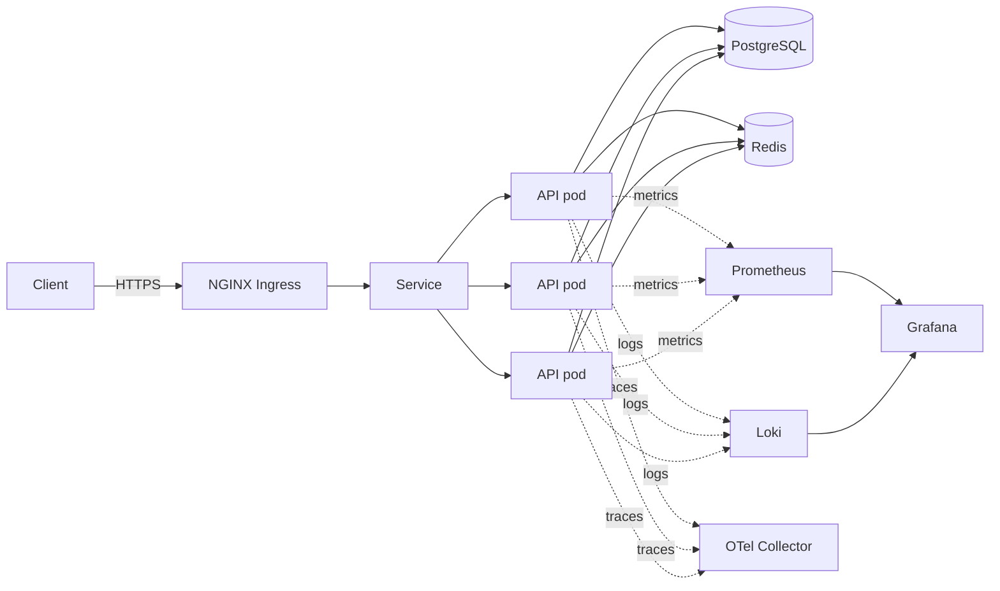
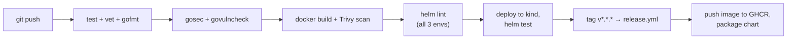

# cloudforge

A production-style deployment platform for a Go REST API: Kubernetes,
Helm, Terraform, full observability (metrics/logs/traces), and a CI
pipeline that actually deploys to a kind cluster and runs a smoke test
before calling itself green.

Everything here runs locally — `docker compose up` for the fastest inner
loop, or a kind cluster for the real Kubernetes path. No cloud account
required to try any of it.

**Stack:** Go · PostgreSQL · Redis · Kubernetes · Helm · Docker · Terraform
· NGINX Ingress · Prometheus · Grafana · Loki · OpenTelemetry · GitHub Actions · k6

## Contents

- [Architecture](docs/architecture.md) — diagrams, request path, deployment flow
- [Disaster recovery](docs/DISASTER_RECOVERY.md) — failure scenarios, RTO/RPO, backup strategy
- [Security](docs/SECURITY.md) — container hardening, NetworkPolicy, CI scanning
- [Secrets management](docs/SECRETS.md) — what's here vs. what production needs
- [Terraform](terraform/README.md) — generic-Kubernetes infra, no cloud credentials
- [Helm chart](deploy/helm/cloudforge/README.md) — dev/staging/production overlays
- [Observability stack](observability/README.md) — Prometheus/Grafana/Loki/OTel install steps
- [k6 load test](load-test/k6/README.md)

## Quickstart

### Option A — Docker Compose (fastest)

```bash
cp .env.example .env
docker compose up --build
curl http://localhost:8080/livez
curl -X POST http://localhost:8080/api/v1/items \
  -H 'Content-Type: application/json' \
  -d '{"name":"widget","description":"first item"}'
```

### Option B — kind (real Kubernetes)

```bash
./scripts/kind-up.sh        # creates a 3-node kind cluster + ingress-nginx
./scripts/deploy-local.sh   # builds the image, loads it into kind, helm installs, runs helm test

kubectl port-forward svc/cloudforge -n cloudforge-dev 8080:80
curl http://localhost:8080/livez
```

Tear down with `./scripts/kind-down.sh`.

## Architecture



Full diagram with the deployment pipeline and namespace boundaries in
[docs/architecture.md](docs/architecture.md).

**Why these choices:**
- **Namespace-per-environment** on one cluster for the demo path — real
  isolation via NetworkPolicy + RBAC without needing three clusters to try
  it out. Production would typically get a dedicated cluster in practice.
- **In-chart PostgreSQL/Redis for dev/staging, external managed services
  for production** — the chart bundles minimal StatefulSets
  (`postgres:16-alpine` / `redis:7-alpine`, no third-party subchart) so the
  whole thing runs standalone in kind. `values-production.yaml` disables
  them and points at `secrets.existingSecret` instead. See
  [docs/DISASTER_RECOVERY.md](docs/DISASTER_RECOVERY.md) for why that
  distinction matters.
- **Terraform stops at the Kubernetes API** — `kubernetes`/`helm`
  providers only, authenticated via kubeconfig. Works identically against
  EKS/GKE/AKS/kind; no cloud provider block, no credentials in this repo.
  See [terraform/README.md](terraform/README.md).

## Deployment flow



Every job in [.github/workflows/ci.yml](.github/workflows/ci.yml) has to
pass before a merge is considered clean — including a real kind deployment
and `helm test`, not just `helm template` syntax checking. See
[.github/workflows/ci.yml](.github/workflows/ci.yml) and
[.github/workflows/release.yml](.github/workflows/release.yml).

## Observability

All three pillars are wired to the same request:

- **Metrics** — `http_requests_total`, `http_request_duration_seconds`
  (histogram, for p50/p95/p99), `http_requests_in_flight`, plus Go runtime
  metrics, all exposed at `/metrics` and scraped by Prometheus. Grafana
  dashboard at [observability/grafana/dashboards/cloudforge-api.json](observability/grafana/dashboards/cloudforge-api.json)
  — real panels, not a screenshot, generated from these exact metric names.
- **Logs** — structured JSON via `log/slog`, one line per request with
  method/path/status/duration/request ID, shipped by Promtail into Loki.
- **Traces** — OpenTelemetry via `otelhttp` middleware, exported to an OTel
  Collector over OTLP (see [observability/otel/otel-collector-config.yaml](observability/otel/otel-collector-config.yaml)).
- **Alerts** — [observability/prometheus/alert-rules.yaml](observability/prometheus/alert-rules.yaml)
  covers error rate, p99 latency, crash-looping pods, HPA pinned at max,
  and zero ready pods.

See [observability/README.md](observability/README.md) for the full
install sequence.

## Scaling strategy

- **HorizontalPodAutoscaler** on CPU (65–70% target depending on
  environment) and memory, `minReplicas`/`maxReplicas` tightened per
  environment (2–10 in dev, 3–20 in production) —
  [values.yaml](deploy/helm/cloudforge/values.yaml).
- **Scale-up is fast, scale-down is conservative**: `behavior.scaleUp` has
  a 0s stabilization window (react immediately to load), `scaleDown` has a
  300s window (don't flap pods down right as traffic dips).
- **PodDisruptionBudget** (`minAvailable`, 1 in dev/staging, 2 in
  production) ensures voluntary disruptions (node drains, cluster
  upgrades) never take capacity below a safe floor.
- **Pod anti-affinity** (preferred, not required) spreads replicas across
  nodes so a single node loss doesn't take out every replica at once.
- **Startup probe** gives slow-starting dependencies (a cold Postgres
  StatefulSet) up to ~150s before liveness/readiness probes even start
  evaluating — see the retry-with-backoff connection logic in
  [cmd/api/main.go](cmd/api/main.go), which was specifically added after
  testing on a fresh kind cluster showed the naive fail-fast approach
  crash-looping while Postgres was still running `initdb`.

## Security

Non-root, read-only root filesystem, all capabilities dropped, seccomp
`RuntimeDefault`, default-deny NetworkPolicy, gosec + govulncheck + Trivy
in CI. Full breakdown in [docs/SECURITY.md](docs/SECURITY.md).

## Failure scenarios

Pod crash, node failure, full cluster loss, bad deploy, dependency outage —
each with detection method, blast radius, and recovery steps, in
[docs/DISASTER_RECOVERY.md](docs/DISASTER_RECOVERY.md). Includes a
practice-before-you-need-it runbook checklist.

## CI/CD pipeline

[.github/workflows/ci.yml](.github/workflows/ci.yml):

| Job | What it does |
|---|---|
| `test` | `go vet`, `gofmt -l` check, `go test -race` against real Postgres/Redis service containers |
| `security-scan` | gosec (SARIF → code scanning), govulncheck |
| `docker-build` | multi-stage build, Trivy image scan (SARIF → code scanning) |
| `helm-lint` | `helm lint` + `helm template` for dev/staging/production |
| `deployment-validation` | spins up a kind cluster, deploys the chart, runs `helm test` — a real deploy, not a dry run |

[.github/workflows/release.yml](.github/workflows/release.yml) triggers on
`v*.*.*` tags: builds and pushes a multi-arch image to GHCR, packages the
Helm chart as a versioned artifact.

## Local development

```bash
go run ./cmd/api          # needs DATABASE_URL/REDIS_ADDR reachable — see .env.example
go test ./...
go vet ./...
gofmt -l .
docker compose up --build # full stack: api + postgres + redis
```

Endpoints: `GET /livez`, `GET /readyz`, `GET /startupz`, `GET /version`,
`GET /metrics`, and `/api/v1/items` (POST/GET/PUT/DELETE).

## Production considerations

Documented inline rather than aspirationally listed here — see the
comments in [values-production.yaml](deploy/helm/cloudforge/values-production.yaml)
and [terraform/environments/production](terraform/environments/production)
for what changes between dev and production and why: external managed
datastores instead of in-cluster StatefulSets, `secrets.existingSecret`
instead of inline values, 3+ replicas with a stricter PodDisruptionBudget,
and TLS ingress with cert-manager annotations.

## Repository layout

```
cmd/api/            entrypoint, HTTP server, graceful shutdown
internal/           config, handlers, middleware, storage, telemetry
deploy/helm/         Helm chart (dev/staging/production values)
deploy/kind/          kind cluster config
terraform/           kubernetes/helm-provider infra, per environment
observability/       Prometheus/Grafana/Loki/OTel configs and dashboards
load-test/k6/         k6 load test script
scripts/             kind-up / deploy-local / kind-down
docs/                architecture, disaster recovery, security, secrets
.github/workflows/    CI and release pipelines
```
