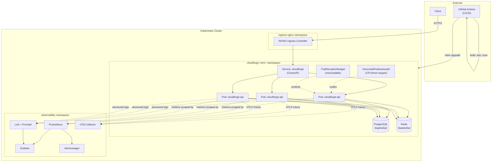

# Architecture

## Request path

1. Client sends HTTPS request to the ingress hostname.
2. `ingress-nginx` (deployed cluster-wide, terminates TLS via cert-manager
   in staging/production) routes to the `cloudforge` Service based on host
   + path rules defined per-environment in `values-<env>.yaml`.
3. The Service load-balances across API pods that are currently passing
   their readiness probe — pods still connecting to Postgres/Redis at
   startup, or draining during a rolling update, are excluded automatically.
4. The API pod handles the request: reads/writes go through `pgx` to
   PostgreSQL; `GET /api/v1/items/{id}` checks Redis first (60s TTL) before
   falling back to Postgres.
5. Every request emits: a structured JSON log line (stdout → Promtail →
   Loki), a Prometheus counter/histogram observation (`/metrics` →
   scraped by Prometheus), and an OTel span (→ OTLP → Collector →
   configured trace backend).

## Deployment flow

```mermaid
flowchart LR
    dev["git push"] --> ci["CI: test, vet,\nsecurity scan"]
    ci --> build["Docker build\n+ Trivy scan"]
    build --> lint["Helm lint\n(dev/staging/prod)"]
    lint --> kindval["Deploy to kind,\nhelm test"]
    kindval --> merge["Merge to main"]
    merge --> tag["git tag v*.*.*"]
    tag --> release["Release workflow:\npush image to GHCR,\npackage chart"]
    release --> cdstaging["helm upgrade\n(staging)"]
    cdstaging --> smoke["k6 smoke test"]
    smoke --> cdprod["helm upgrade\n(production)"]
```

Every environment is driven by the same chart with a different
`values-<env>.yaml` overlay — there is no environment-specific branching in
application code or Dockerfile, only in Helm values and which Terraform
`environments/` directory gets applied.

## Why these boundaries

- **Namespace per environment** (`cloudforge-dev`, `cloudforge-staging`,
  `cloudforge-production`) rather than separate clusters for dev/staging —
  keeps the demo runnable on a single kind cluster while still modeling
  real environment isolation via NetworkPolicy + RBAC boundaries. Production
  would typically get its own cluster in a real org; that's a
  cost/blast-radius decision orthogonal to what this chart expresses.
- **In-chart PostgreSQL/Redis for dev/staging, external for production** —
  documented in [values-production.yaml](../deploy/helm/cloudforge/values-production.yaml)
  and [docs/DISASTER_RECOVERY.md](DISASTER_RECOVERY.md). Running stateful
  workloads in-cluster is fine for disposable environments and wrong for
  anything with a real RPO/RTO requirement.
- **Terraform stops at the Kubernetes API boundary** — see
  [terraform/README.md](../terraform/README.md) for why cluster
  provisioning itself isn't included.
